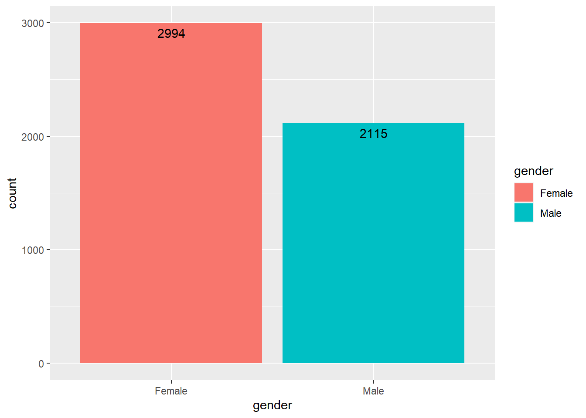
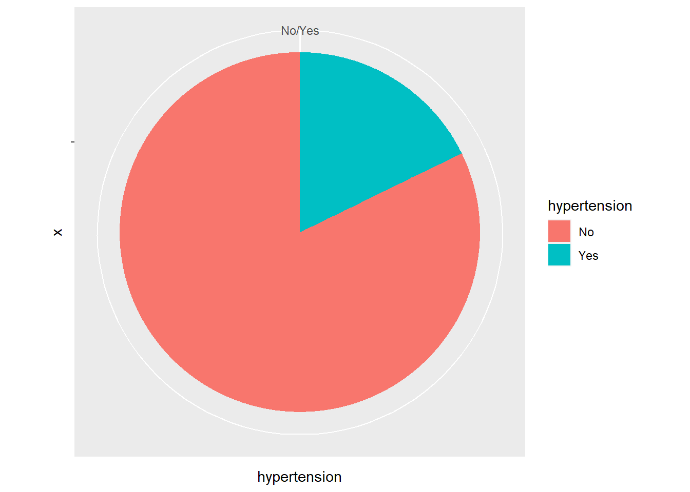

## Prediction of Stroke in Patients using Random Forest Algorithm
For this project, we are using a dataset from Kaggle to predict the risk of a stroke in patients.The task is to use a training set to learn and use that knowledge to predict the risk in a testing set. Before the prediction we will do an exploratory data analysis to understand more about the data and finally we will use Random forest Algorithm to predict the outcome.

### Loading Libraries

```r
library(tidyverse)
library(caret)
library(randomForest)
library(skimr)
library(ggplot2)
```

### Read Data


```r
df_stroke<-read.csv("C:\\Users\\irish\\Downloads\\archive\\healthcare-dataset-stroke-data.csv",stringsAsFactors = TRUE)
```
### Summarize Data

```r
summary(df_stroke)
```

```
##        id           gender          age         hypertension    
##  Min.   :   67   Female:2994   Min.   : 0.08   Min.   :0.00000  
##  1st Qu.:17741   Male  :2115   1st Qu.:25.00   1st Qu.:0.00000  
##  Median :36932   Other :   1   Median :45.00   Median :0.00000  
##  Mean   :36518                 Mean   :43.23   Mean   :0.09746  
##  3rd Qu.:54682                 3rd Qu.:61.00   3rd Qu.:0.00000  
##  Max.   :72940                 Max.   :82.00   Max.   :1.00000  
##                                                                 
##  heart_disease     ever_married         work_type    Residence_type
##  Min.   :0.00000   No :1757     children     : 687   Rural:2514    
##  1st Qu.:0.00000   Yes:3353     Govt_job     : 657   Urban:2596    
##  Median :0.00000                Never_worked :  22                 
##  Mean   :0.05401                Private      :2925                 
##  3rd Qu.:0.00000                Self-employed: 819                 
##  Max.   :1.00000                                                   
##                                                                    
##  avg_glucose_level      bmi               smoking_status     stroke       
##  Min.   : 55.12    N/A    : 201   formerly smoked: 885   Min.   :0.00000  
##  1st Qu.: 77.25    28.7   :  41   never smoked   :1892   1st Qu.:0.00000  
##  Median : 91.89    28.4   :  38   smokes         : 789   Median :0.00000  
##  Mean   :106.15    26.1   :  37   Unknown        :1544   Mean   :0.04873  
##  3rd Qu.:114.09    26.7   :  37                          3rd Qu.:0.00000  
##  Max.   :271.74    27.6   :  37                          Max.   :1.00000  
##                    (Other):4719
```

```r
glimpse(df_stroke)
```

```
## Rows: 5,110
## Columns: 12
## $ id                <int> 9046, 51676, 31112, 60182, 1665, 56669, 53882, 10434…
## $ gender            <fct> Male, Female, Male, Female, Female, Male, Male, Fema…
## $ age               <dbl> 67, 61, 80, 49, 79, 81, 74, 69, 59, 78, 81, 61, 54, …
## $ hypertension      <int> 0, 0, 0, 0, 1, 0, 1, 0, 0, 0, 1, 0, 0, 0, 0, 1, 0, 1…
## $ heart_disease     <int> 1, 0, 1, 0, 0, 0, 1, 0, 0, 0, 0, 1, 0, 1, 1, 0, 1, 0…
## $ ever_married      <fct> Yes, Yes, Yes, Yes, Yes, Yes, Yes, No, Yes, Yes, Yes…
## $ work_type         <fct> Private, Self-employed, Private, Private, Self-emplo…
## $ Residence_type    <fct> Urban, Rural, Rural, Urban, Rural, Urban, Rural, Urb…
## $ avg_glucose_level <dbl> 228.69, 202.21, 105.92, 171.23, 174.12, 186.21, 70.0…
## $ bmi               <fct> 36.6, N/A, 32.5, 34.4, 24, 29, 27.4, 22.8, N/A, 24.2…
## $ smoking_status    <fct> formerly smoked, never smoked, never smoked, smokes,…
## $ stroke            <int> 1, 1, 1, 1, 1, 1, 1, 1, 1, 1, 1, 1, 1, 1, 1, 1, 1, 1…
```


```r
skim(df_stroke)
```


Table: Data summary

|                         |          |
|:------------------------|:---------|
|Name                     |df_stroke |
|Number of rows           |5110      |
|Number of columns        |12        |
|_______________________  |          |
|Column type frequency:   |          |
|factor                   |6         |
|numeric                  |6         |
|________________________ |          |
|Group variables          |None      |


**Variable type: factor**

|skim_variable  | n_missing| complete_rate|ordered | n_unique|top_counts                               |
|:--------------|---------:|-------------:|:-------|--------:|:----------------------------------------|
|gender         |         0|             1|FALSE   |        3|Fem: 2994, Mal: 2115, Oth: 1             |
|ever_married   |         0|             1|FALSE   |        2|Yes: 3353, No: 1757                      |
|work_type      |         0|             1|FALSE   |        5|Pri: 2925, Sel: 819, chi: 687, Gov: 657  |
|Residence_type |         0|             1|FALSE   |        2|Urb: 2596, Rur: 2514                     |
|bmi            |         0|             1|FALSE   |      419|N/A: 201, 28.: 41, 28.: 38, 26.: 37      |
|smoking_status |         0|             1|FALSE   |        4|nev: 1892, Unk: 1544, for: 885, smo: 789 |


**Variable type: numeric**

|skim_variable     | n_missing| complete_rate|     mean|       sd|    p0|      p25|      p50|      p75|     p100|hist  |
|:-----------------|---------:|-------------:|--------:|--------:|-----:|--------:|--------:|--------:|--------:|:-----|
|id                |         0|             1| 36517.83| 21161.72| 67.00| 17741.25| 36932.00| 54682.00| 72940.00|▇▇▇▇▇ |
|age               |         0|             1|    43.23|    22.61|  0.08|    25.00|    45.00|    61.00|    82.00|▅▆▇▇▆ |
|hypertension      |         0|             1|     0.10|     0.30|  0.00|     0.00|     0.00|     0.00|     1.00|▇▁▁▁▁ |
|heart_disease     |         0|             1|     0.05|     0.23|  0.00|     0.00|     0.00|     0.00|     1.00|▇▁▁▁▁ |
|avg_glucose_level |         0|             1|   106.15|    45.28| 55.12|    77.24|    91.88|   114.09|   271.74|▇▃▁▁▁ |
|stroke            |         0|             1|     0.05|     0.22|  0.00|     0.00|     0.00|     0.00|     1.00|▇▁▁▁▁ |
### Data Summary
* There are 5110 rows and 12 columns in the data
* 6 Numeric and 6 Character columns
* 1 Row of other value in gender
* There is a value 'N/A' in bmi in 201 rows

### BMI column is in character format. Converting it to numeric

```r
df_stroke$bmi<-as.numeric(df_stroke$bmi)
```


### Changing N/A to NA so that R can understand

```r
df_stroke$bmi[df_stroke$bmi=="N/A"]=NA
colSums(is.na(df_stroke))
```

```
##                id            gender               age      hypertension 
##                 0                 0                 0                 0 
##     heart_disease      ever_married         work_type    Residence_type 
##                 0                 0                 0                 0 
## avg_glucose_level               bmi    smoking_status            stroke 
##                 0                 0                 0                 0
```


### Replacing NAs
Since height and weight are not provided, we cant calculate bmi and replace NAs with it. In this case,the best option is to replace the NA values with the mean


```r
df_stroke$bmi[is.na(df_stroke$bmi)]<-mean(df_stroke$bmi)
colSums(is.na(df_stroke))
```

```
##                id            gender               age      hypertension 
##                 0                 0                 0                 0 
##     heart_disease      ever_married         work_type    Residence_type 
##                 0                 0                 0                 0 
## avg_glucose_level               bmi    smoking_status            stroke 
##                 0                 0                 0                 0
```

### Only 1 value as other in gender. So it is better to remove it

```r
df_stroke<-df_stroke %>% 
  filter(!gender=="Other")
nrow(df_stroke)
```

```
## [1] 5109
```

### Converting all non-numeric variables to factors


```r
df_stroke$stroke<- factor(df_stroke$stroke, levels = c(0,1), labels = c("No", "Yes"))

df_stroke$hypertension<-factor(df_stroke$hypertension,levels = c(0,1),labels=c("No","Yes"))

df_stroke$heart_disease<- factor(df_stroke$heart_disease, levels = c(0,1), labels = c("No", "Yes"))
```


### Plots to Visualize


```r
p1<-ggplot(df_stroke,aes(x=gender,fill=gender))+geom_bar()+
  geom_text(aes(label=..count..),stat = "Count", vjust= 1.5)
p1
```



```r
p2<-ggplot(df_stroke,aes(x="",y=hypertension,fill=hypertension))+geom_bar(stat = "identity")+coord_polar("y")
p2
```




